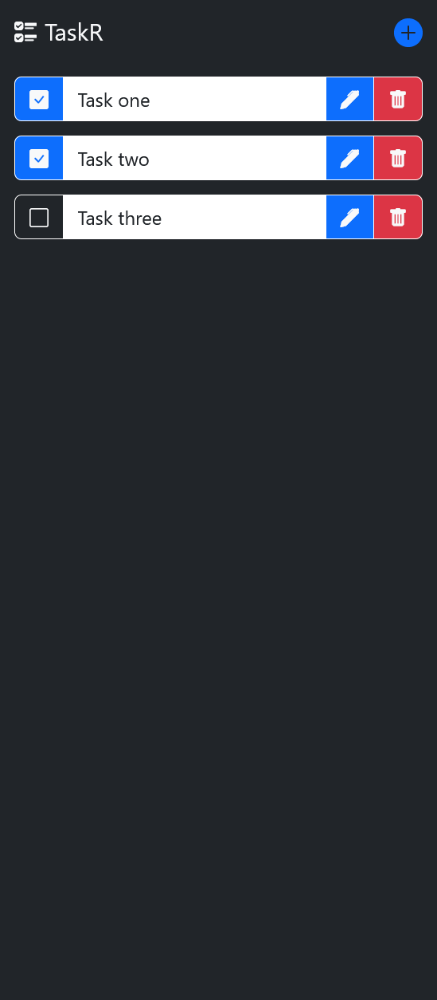

TODO_APP_FLASK_PYTHON
---

A basic todo app, written in python using the flask workflow.

# files 
## main.py
this is the main file that will run and provide routes for the app.

## templates/.*html
these files handle the UI

## static/.*
these files are css files

# Images
# Home Page

# New Task Form

# Delete Task
